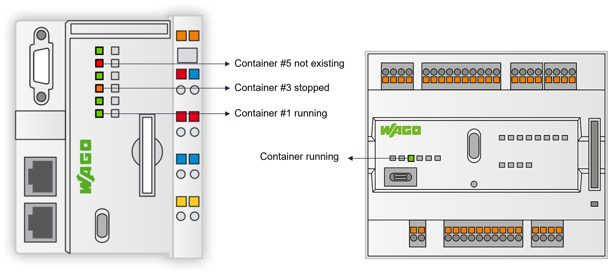

# monitor_container_led

<div style="text-align: center">

</div>


Simple script to display container status on WAGO Controller user LEDs.
- GREEN : Container running
- ORANGE : Container stopped
- RED : Container does not exist

### Installation
Download and place the script monitor_container_led i.e. folder /etc/config-tools.

Give it execution permission :
```shell
chmod 750 /etc/config-tools/monitor_container_led
```


### Usage

```shell
/etc/config-tools/monitor_container_led CONTAINER_NAME LEDID
```

Example : 
```shell
/etc/config-tools/monitor_container_led mbusd U1
```

Make sure LED isn't used by CODESYS and is available on the PFC variant. 

### Set periodic check

Then you need to use CRON in order to trigger a period call of the script. 

To open crontab with nano (easier than vim ?)
```shell
export VISUAL=nano; crontab -e
```
Copy/Paste the following (adapt to your container name and LED) :
```shell
* * * * *  /etc/config-tools/monitor_container_led mbusd U1
```
This will check the container state every minute. 
You can add several lines if you have several containers to monitor

### Go further
We could add a deeper check of the container based on logs or based on status (when provided by the application, i.e Node-RED).
When using a device with only 1 User LED (750-8217, CC100...) we could adapt the script to display a synthesis of monitored containers.
Find a way to blink LED could be useful too.

